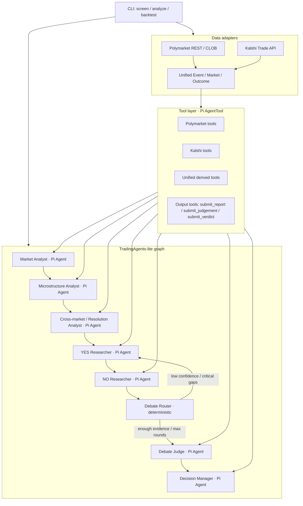

# Squirrel — architecture notes and roadmap

> 个人开源项目。预测市场数据源 + 分析框架 + 基于 Pi 的 TradingAgents-lite agent 判断层。
> 状态：**MVP architecture note / roadmap**。本文档记录架构决策、known gaps、当前实现边界和后续演进方向。

---

## 1. 项目目标

Squirrel 是一个轻量 prediction-market research playground：

1. 接入 **Polymarket** 和 **Kalshi** 的公开 API，获取实时市场数据（标的、概率、成交量）。
2. 设计一个**分析框架**：筛选有价值标的、追踪概率变化、识别异常信号。
3. 参考 **TradingAgents** 的架构，加入基于 Pi Agent runtime 的多角色判断层。
4. 通过 README / examples / roadmap 说明数据结构、框架设计思路、示例输出和已知边界。

本项目的定位：

- **主目标**：证明框架能力，而不是声称模型已具备稳定预测 alpha。
- **核心能力**：把多平台预测市场数据标准化为工具层，让 Pi agents 可以通过 tool calls 自主查询、分析、产出结构化判断。
- **对外口径**：当前预测结果受限于公开数据源的覆盖和质量；如果后续接入更完整的历史盘口、成交明细、新闻/宏观数据、结算规则源，框架可以复用，判断质量应随数据源改善而提升。

---

## 2. 当前实现状态与历史 Drift

当前 repo 已经完成：

- Polymarket / Kalshi 基础数据 adapter。
- `UnifiedEvent / UnifiedMarket / Outcome` 统一模型。
- `screen / arbitrage / tracker` 三个分析模块。
- legacy TradingAgents 风格的分析师 -> 辩论 -> 估计 -> 风控顺序 pipeline。
- v2 Pi Agent graph：真实 Pi `Agent` 节点、role-specific toolsets、YES/NO debate、Debate Router、Judge、Decision Manager。
- 示例输出和 README。

项目早期存在两个核心 drift；v2 MVP 已经修正了主路径，但仍有成熟度 gap：

1. **早期没有真正基于 Pi agent runtime 做 agent**
   - 早期主要使用 `@earendil-works/pi-ai` 的模型/provider/structured-output 能力。
   - `submit_estimate` / `submit_decision` 更像强制 JSON 输出，不是 agent 在分析过程中主动 tool call、接收 tool result、继续推理。
   - v2 已改为：每个分析节点是一个真实的 `@earendil-works/pi-agent-core` `Agent`，拥有自己的 prompt、toolset、agent loop 和事件流。

2. **早期把 TradingAgents 简化成了写死 workflow**
   - TradingAgents 原项目基于 LangGraph：节点、工具节点、conditional edges、debate state 共同组成图。
   - 早期 `runDebate()` 是手写 round-robin loop，缺少“agent 节点 -> tool calls -> tool result -> 回到 agent 节点”的结构。
   - v2 已改为：轻量 TradingAgents-lite graph runner；graph 由 Squirrel 写，agent loop 交给 Pi。

当前 remaining gap 不是“没用 Pi agent”，而是成熟度差距：checkpoint/resume、memory/reflection、typed state schema、更多 router target、v2-native evaluation 仍待补齐。

---

## 3. 架构决策

### ADR-1: 使用 Pi 作为真实 agent runtime

**决策**：使用 `@earendil-works/pi-agent-core` 的 `Agent` 作为每个角色节点的执行运行时。

**理由**：

- Pi 轻量，适合快速搭出可扩展的 agent/tool/graph 原型。
- Pi 原生支持 tool calls、tool execution、tool result 后继续下一 turn、事件流、steer/followUp。
- 比直接调用 `llm.text()` 更能体现 agent 能力和可扩展性。

**边界**：

- `@earendil-works/pi-ai` 仍然负责模型/provider/TypeBox schema。
- `@earendil-works/pi-agent-core` 负责单 agent loop。
- 多 agent graph 不由 Pi 原生提供，需要项目自己实现。

### ADR-2: 自研轻量 TradingAgents-lite graph runner

**决策**：不引入 LangGraph；用 TypeScript 实现一个小的 graph runner，编排 Pi Agent 节点。

**理由**：

- Pi agent-core 没有 `StateGraph.add_node/add_edge/add_conditional_edges` 这类 multi-agent graph primitive。
- 当前项目只需要 TradingAgents-lite 能力，不需要完整复刻 LangGraph。
- 自研 runner 可以保持 repo 小而清楚，同时解释“Pi provides agent runtime; this repo adds TradingAgents-inspired graph orchestration”。

目标抽象：

```ts
type NodeId =
  | "market_analyst"
  | "microstructure_analyst"
  | "cross_market_analyst"
  | "yes_researcher"
  | "no_researcher"
  | "debate_judge"
  | "decision_manager";

interface GraphNode {
  id: NodeId;
  role: RoleConfig;
  tools: AgentTool[];
  next: (state: AnalysisState) => NodeId | "END";
}
```

### ADR-3: API 数据必须通过 tools 暴露给 agent

**决策**：Polymarket / Kalshi 不只是 data adapter，也必须成为 Pi `AgentTool`。

**理由**：

- Polymarket / Kalshi 是当前框架的核心 prediction-market 数据入口。
- Agent 判断层应能主动查询市场、盘口、历史概率、结算规则，而不是只吃一段预拼 prompt。
- 工具层是数据源可扩展的关键：未来接更多真实数据源时，不需要重写 agent graph。

### ADR-4: Role-specific toolsets，不做全局工具池

**决策**：每个角色只拿自己需要的工具。

**理由**：

- 减少 tool selection 噪音。
- 更接近 TradingAgents：market/news/fundamentals 等角色各有 tool node。
- 便于解释 prompt/toolset 设计：每个 agent 的信息权限和职责一致。

### ADR-5: 明确把预测准确率和数据源质量解耦

**决策**：README / PLAN / examples 中明确 known gaps：当前 demo 主要展示框架能力，不声称预测结果稳定优于市场。

**理由**：

- 公开 API 的历史深度、盘口快照、新闻、宏观和结算数据不完整。
- LLM 判断没有可靠的未来 ground truth，backtest/OOS 容易受 hindsight、样本选择和数据缺失影响。
- 诚实说明边界，反而能体现工程判断。

---

## 4. 目标架构



职责：

- **Data adapters**：只负责真实 API 接入和平台字段归一化。
- **Tool layer**：把原始平台 API 和派生分析能力包装为 Pi `AgentTool`。
- **TradingAgents-lite graph**：负责编排多个 Pi agents、条件流转、共享状态和最终 verdict。
- **Debate Router**：读取结构化 report state，而不是只按固定 round 计数推进。

---

## 5. Toolset 设计

### 5.1 核心平台 API tools

Polymarket：

- `polymarket_search_markets`
  - 输入：`query`, `limit`, `active`
  - 输出：候选 market 列表，包含 question、market id、YES probability、volume、liquidity、close time。
- `polymarket_get_market`
  - 输入：`marketId`
  - 输出：市场详情、outcomes、price、volume、liquidity、结算描述。
- `polymarket_get_price_history`
  - 输入：`tokenId`, `interval`, `fidelity`
  - 输出：历史概率序列，用于 drift/momentum/backtest。
- `polymarket_get_orderbook`
  - 输入：`tokenId`
  - 输出：bid/ask/depth，用于微观结构分析。

Kalshi：

- `kalshi_search_markets`
  - 输入：`query`, `limit`, `status`
  - 输出：候选 market/event 列表，包含 ticker、title、YES probability、volume、open interest。
- `kalshi_get_market`
  - 输入：`ticker`
  - 输出：市场详情、yes/no bid/ask、volume、open interest、rules。
- `kalshi_get_orderbook`
  - 输入：`ticker`
  - 输出：orderbook/depth。

### 5.2 必做：统一派生 tools

- `get_verified_market_snapshot`
  - 对某个 `source + marketId` 返回统一可信快照。
  - 作用类似 TradingAgents 的 `get_verified_market_snapshot`：防止 agent 编造价格、成交量、盘口。
- `get_related_markets`
  - 跨 Polymarket / Kalshi 查相似市场，用于同事件候选和异常价差信号。
- `get_probability_history`
  - 返回统一概率历史。Polymarket 可走 CLOB history；Kalshi 若公开历史不足，则返回当前可得快照并标记 gap。
- `get_probability_indicators`
  - 输出 1h/24h/7d 概率变化、概率波动率、bid-ask spread、深度不平衡、volume/liquidity ratio、extreme probability flag。
- `get_cross_platform_anomaly_signals`
  - 输出相似市场间的概率差、相似度、方向一致性风险。命名为 anomaly，不命名为 guaranteed arbitrage。

### 5.3 必做：结构化输出 tools

- `submit_report`
  - Analyst 节点调用。
  - schema: `{ summary, keySignals, risks, confidence, dataGaps }`
  - tool result 可设置 `terminate: true`，表示当前 agent 节点完成。
- `submit_judgement`
  - Debate Judge 节点调用。
  - schema: `{ winner, reasoning, strongestYesClaims, strongestNoClaims, dataGaps }`
  - 用结构化 winner 写入 `state.debate`，避免从自由文本猜测裁决。
- `submit_verdict`
  - Decision Manager 调用。
  - schema: `{ side, pHat, marketP, edge, action, size, reasoning, dataGaps }`
  - 最终 verdict 由 tool 参数落入共享 state，而不是从自由文本中解析。

### 5.4 可选：从 TradingAgents 迁移的外部信息 tools

可加，但不作为 MVP 依赖：

- `get_event_news`
  - 类似 TradingAgents 的 `get_news / get_global_news`，用于事件新闻。
  - 风险：需要稳定新闻源；公开搜索结果可能噪声大，且引入 prompt injection 风险。
- `get_macro_indicators`
  - 类似 TradingAgents 的 FRED macro tool，对 Fed、CPI、recession、oil 等市场有帮助。
  - 风险：只覆盖宏观类市场，不适用于体育、娱乐、crypto meme 等大量预测市场。

不建议第一版迁移：

- `get_fundamentals`, `get_balance_sheet`, `get_cashflow`, `get_income_statement`
  - 股票基本面工具，不适合预测市场通用框架。
- `get_insider_transactions`
  - 覆盖面窄，容易偏离预测市场通用框架。
- 股票 TA 指标原样迁移
  - 预测市场份额价格本身就是概率，直接搬 MACD/RSI 叙事容易误导。

### 5.5 Role -> toolset

当前 v2 active toolset 先只打开确定可用、无额外交易所网络依赖的工具；source/search/orderbook/history tools 保留实现和计划，但不分配给 v2 agent，等 live API 连通性稳定后再打开。

### 5.6 State-driven routing MVP

Router 是 deterministic 的，不调用 LLM。它在每个 NO Researcher 之后运行，目标是决定下一节点：

```text
if debateRound < minDebateRounds:
  next = YES Researcher
else if debateRound >= maxDebateRounds:
  next = Debate Judge
else if latest YES/NO reports show low confidence or critical data gaps:
  next = YES Researcher
else:
  next = Debate Judge
```

MVP 只在 `YES Researcher` 和 `Debate Judge` 之间路由。后续可以扩展到 `Market Analyst`、`Macro Analyst`、`Resolution Analyst`、`Risk Manager` 等补充节点。

| Role | Toolset |
|---|---|
| Market Analyst | `get_verified_market_snapshot`, `get_probability_indicators`, `submit_report` |
| Microstructure Analyst | `get_probability_indicators`, `get_verified_market_snapshot`, `submit_report` |
| Cross-market / Resolution Analyst | `get_cross_platform_anomaly_signals`, `get_verified_market_snapshot`, `submit_report` |
| YES Researcher | analyst reports + debate transcript + optional `get_verified_market_snapshot`, `get_probability_indicators`, `submit_report` |
| NO Researcher | analyst reports + debate transcript + optional `get_verified_market_snapshot`, `get_probability_indicators`, `submit_report` |
| Debate Judge | analyst reports + full debate transcript + `submit_judgement` |
| Decision Manager | analyst reports + debate transcript + judge decision + `get_verified_market_snapshot`, `get_probability_indicators`, `submit_verdict` |

Planned but temporarily inactive in v2: `polymarket_search_markets`, `kalshi_search_markets`, `polymarket_get_orderbook`, `kalshi_get_orderbook`, `polymarket_get_market`, `kalshi_get_market`, `polymarket_get_price_history`, `get_probability_history`, `get_related_markets`.

---

## 6. Agent 角色

目标版本保持轻量，避免为了“多 agent”堆复杂度。

| TradingAgents 原角色 | 本项目角色 | 目标职责 |
|---|---|---|
| Market Analyst | Market Analyst | 查并核验目标市场基础快照，说明市场价、成交量、流动性、期限 |
| Sentiment / Technical | Microstructure Analyst | 用盘口、价差、概率变化替代股票技术指标 |
| News / Fundamentals | Cross-market / Resolution Analyst | 检查相似市场、结算规则、定义歧义、跨平台异常 |
| Bull Researcher | YES Researcher | 基于报告论证 YES 发生 |
| Bear Researcher | NO Researcher | 基于报告论证 NO 发生 |
| Research Manager | Debate Judge | 多轮辩论后裁决更强一方或标记 UNCLEAR |
| Trader / Risk | Decision Manager | 输出 `pHat`, `edge`, `side`, `action`, `size`, `dataGaps` |

可选扩展：

- `News Analyst`：接入稳定新闻源后启用。
- `Macro Analyst`：接入 FRED/宏观数据后启用。
- `Reflector`：结算后基于 Brier/log-loss 写回经验。

---

## 7. 数据模型

两平台统一为：

```ts
type Source = "polymarket" | "kalshi";

interface UnifiedEvent {
  source: Source;
  id: string;
  title: string;
  slug?: string;
  category?: string;
  closeTime?: string;
  active: boolean;
  mutuallyExclusive: boolean;
  volume?: number;
  liquidity?: number;
  markets: UnifiedMarket[];
}

interface UnifiedMarket {
  source: Source;
  id: string;            // PM: conditionId / Kalshi: ticker
  question: string;
  description?: string;  // settlement rules
  outcomes: Outcome[];
  volume?: number;
  liquidity?: number;
  openInterest?: number;
  priceChange24h?: number;
  closeTime?: string;
  resolution?: {
    resolved: boolean;
    resolvedOutcome?: string;
    status?: string;
  };
  eventId?: string;
}

interface Outcome {
  name: string;
  probability: number;   // normalized to [0,1]
  bid?: number;
  ask?: number;
  tokenId?: string;      // Polymarket CLOB token id
}
```

平台差异：

1. Polymarket Gamma 的 `outcomes` / `outcomePrices` / `clobTokenIds` 是 stringified JSON，需要二次 parse。
2. Kalshi 新版 dollar 字段已是 `[0,1]`，不再除以 100。
3. Kalshi 一条 market 自带 Yes/No；Polymarket 通常通过 outcomes 数组表达。
4. 结算说明、resolution status、盘口深度、历史价格在两个平台覆盖不一致，必须在 tool result 的 `dataGaps` 中显式返回。

---

## 8. Known Gaps

这些 gap 是已知限制，不应在 README/roadmap 中隐瞒。

### 8.1 数据源覆盖 gap

- Polymarket / Kalshi 的公开 API 足够做实时市场快照，但历史盘口、成交明细和统一历史概率覆盖不完整。
- Kalshi 历史概率数据公开能力弱于 Polymarket CLOB history；相关工具需要返回 “unavailable / partial” 而不是伪造。
- 新闻、宏观、社媒、官方事件源尚未作为稳定一等数据源接入。
- 结算规则文本有时不完整或平台间语义不一致；跨平台价差不能直接等同套利。
- live source smoke 可能受当前运行环境网络、交易所 API 可达性、代理设置影响失败；这属于 source/connectivity gap，不影响 `--v2 --demo-market` 对 agent/tool/graph 能力的验证。

对外口径：

> This repo targets the framework layer: source adapters, tool-callable market data, multi-agent reasoning, and structured decisions. Predictive quality is data-limited; with richer historical orderbook/trade data, news/macroeconomic feeds, and settlement metadata, the same framework should produce better calibrated estimates.

### 8.2 Agent 能力 gap

- MVP 不保证 agent 预测能稳定 beat market。
- LLM 可能使用训练时记忆，历史 backtest 有 hindsight bias。
- OOS 样本少，结果只能证明验证管线存在，不能证明统计显著 alpha。

### 8.3 架构成熟度 gap（相对 TradingAgents）

- 当前 v2 已经使用真实 Pi `Agent` runtime 和轻量 graph runner，但还不是完整 LangGraph 级别的 graph platform。
- 还没有 checkpoint/resume、durable decision log、post-settlement reflection memory。
- shared state 仍偏轻量，尚未为所有节点定义强类型 state schema 和可迁移版本。
- graph assembly 仍由 `orchestrateV2.ts` 代码显式连接；还没有从完整 declarative config 生成 graph。
- Debate Router 已是 state-driven，但当前 target set 很窄：只在 `YES Researcher` 和 `Debate Judge` 之间决策；后续应能路由回指定 analyst、Macro/News Analyst 或 Risk Manager。
- Backtest/OOS 仍主要验证 legacy/fixture pipeline，尚未完全复用 v2 Pi Agent graph。

---

## 9. MVP 状态与后续计划

| 阶段 | 内容 | 验证标准 |
|---|---|---|
| 1. Tool layer | `src/agents/tools.ts` 把平台数据和统一派生分析包装成 `AgentTool` | 已完成；v2 使用稳定工具，网络依赖工具暂未分配 |
| 2. Pi Agent node | `runPiAgentNode(role, tools, state)` 使用 `@earendil-works/pi-agent-core.Agent` | 已完成；真实 `--v2 --demo-market` 能跑 Pi toolcall loop |
| 3. Graph runner | 轻量 node/edge/conditional runner | 已完成；analyst -> routed debate -> judge -> decision |
| 4. State-driven router | Debate Router 读取 confidence/dataGaps/round state | 已完成 MVP；target set 仍待扩展 |
| 5. Docs/examples | README/PLAN/examples 说明 TradingAgents-lite on Pi 和 known gaps | 已补 v2 demo toolcall/router/verdict 示例；后续可补更多 live run 输出 |
| 6. TradingAgents parity | checkpoint/resume、memory/reflection、risk team、v2 backtest | 后续能力，不属于当前 MVP |

---

## 10. 验证策略

### 数据层

- 拉真实 Polymarket / Kalshi market。
- 断言 `probability` 在 `[0,1]`。
- 对平台字段差异做单元测试或 fixture 测试：PM stringified JSON、Kalshi dollar strings、Yes/No outcome mapping。

### Tool layer

- 每个 source tool 都有最小 smoke test。
- tool result 必须包含 `source`, `timestamp`, `dataGaps`。
- 外部 API 失败时 fail-open：返回结构化错误，不让整个 graph 崩掉。

### Agent layer

- 用 mock 模型验证 legacy graph 不死循环、conditional edge 正确。
- 用真实模型验证至少一次完整 toolcall loop。
- 最终 verdict 必须来自 `submit_verdict` tool 参数，而不是自由文本解析。

### 预测评估

- 保留 Brier score / OOS 作为验证管线。
- 明确统计意义有限，不作为主要项目承诺。

---

## 11. 开源项目叙事

对外重点讲：

1. **Polymarket / Kalshi 已接入**，并统一成框架内部数据模型。
2. **分析框架不是单点脚本**：包含筛选、概率变化、跨平台异常、结算风险。
3. **Pi 的使用是 agent-runtime 层面的**：每个角色是 Pi Agent，有自己的 toolset 和 loop。
4. **TradingAgents 是架构参考**：我们复用其 node/tool/conditional graph 思想，但针对预测市场做轻量化。
5. **预测结果的数据依赖是已知边界**：当前展示框架能力，未来数据源变强后，判断质量才有更大提升空间。

---

## 12. 当前验收契约

目标命令：

```bash
npm run screen
npm run analyze -- --v2 --demo-market
npm run analyze -- --market "<query>" --mock
npm run analyze -- --market "<query>"
npm run backtest -- --mock
```

通过判据：

- `screen` 输出真实 Polymarket / Kalshi 市场。
- `analyze` 输出 agent 过程、tool calls、最终结构化 verdict。
- README 说明数据结构、框架设计、示例输出、known gaps。
