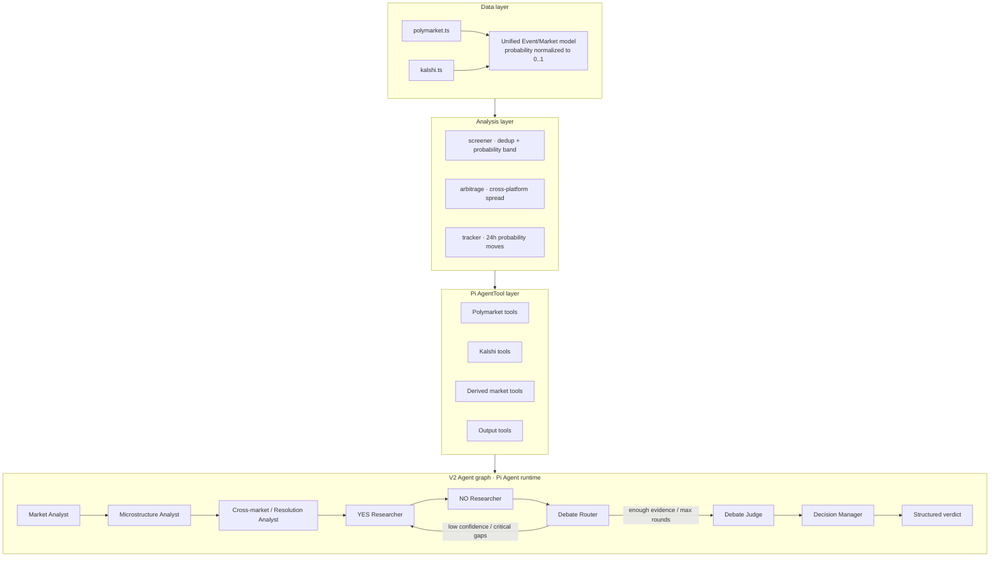

# squirrel

**Squirrel** is a prediction-market data source + Pi-powered TradingAgents-lite analysis framework,
built for the ARTi 2026 Dev track. It ingests live markets from **Polymarket** and **Kalshi**, normalizes them
into one model, screens for tradeable targets, exposes market APIs as Pi tools, and runs a
multi-agent graph that outputs a calibrated probability estimate and a position recommendation.

The core idea: stock trading bets on **price direction**; prediction markets bet on the gap between the
**market-implied probability and the true probability** (mispricing). Binary 0/1 settlement also gives
an unusually clean ground truth for evaluation.

Scope note: this repo targets **framework capability**, not a claim of stable trading alpha. The current
prediction quality is intentionally framed with **data-source gaps known**: public APIs do not provide every
historical orderbook snapshot, trade print, news item, macro series, or authoritative settlement feed that a
production forecaster would want. If richer real data sources are added, the Pi tool layer and graph can reuse
them without changing the core orchestration model.

---

## Architecture



Four layers, decoupled:

- **Data layer** (`src/data/`) — per-platform adapters map raw API payloads into a unified
  `Event / Market / Outcome` model with probabilities normalized to `[0, 1]`. Reading public data needs
  **no API key** on either platform.
- **Analysis layer** (`src/analysis/`) — `screener` (find tradeable targets), `arbitrage` (cross-platform
  spread signals), `tracker` (probability momentum).
- **Tool layer** (`src/agents/tools.ts`) — wraps Polymarket, Kalshi, normalized snapshots, indicators,
  cross-platform anomaly signals, and structured output tools as Pi `AgentTool`s.
- **Agent graph** (`src/agents/orchestrateV2.ts`) — a TradingAgents-inspired graph of real
  `@earendil-works/pi-agent-core` `Agent` nodes: analysts → routed YES/NO debate → judge →
  decision manager.

### Pi SDK layering

Pi is used at two layers:

- `@earendil-works/pi-ai` provides model/provider plumbing and TypeBox schemas.
- `@earendil-works/pi-agent-core` provides the real single-agent runtime in v2: system prompt, toolset,
  toolcall loop, tool execution events, and termination through output tools.

Pi does not provide a LangGraph-style multi-agent `StateGraph`, so Squirrel adds a small graph runner
(`src/agents/graphRunner.ts`). In short: **Pi runs each agent; Squirrel orchestrates the agents.**

### State-driven routing

V2 includes a deterministic **Debate Router**. After each YES/NO pair, it reads structured state rather than
blindly advancing a fixed workflow:

- continue debate until `minDebateRounds` is reached;
- stop at `maxDebateRounds`;
- between those bounds, continue only when latest reports show low confidence or critical gaps such as
  missing current price, settlement source, volatility parameters, or cross-platform validation;
- otherwise route to Debate Judge.

This is intentionally not an LLM router in the MVP. The router is transparent and reproducible; future targets
can include returning to a data analyst, adding a Macro Analyst, or entering a Risk Manager.

### Agent roles: TradingAgents → prediction markets

The skeleton (analysts → adversarial debate → decision → risk → verdict) is kept intact; only the
**data sources and output semantics** of each role change.

| TradingAgents (original) | This project | Model | What changed |
|---|---|---|---|
| Fundamentals Analyst | **Base-Rate Analyst** | haiku | Historical base rates / polls / official stats, not earnings |
| News Analyst | **News Analyst** (promoted to core) | opus | Event-time sensitivity: how much does news move the true probability |
| Sentiment Analyst | **Microstructure & Sentiment** | haiku | Orderbook liquidity + herding + cross-platform gap |
| Technical Analyst | *removed* | — | Share price *is* the probability; TA is meaningless |
| Bull vs Bear debate | **YES vs NO debate** | opus | The most valuable transferable part — kept as-is |
| Research Manager | **Debate Judge** | opus | Judges the stronger side after configured rounds |
| Trader / Risk Manager | **Decision Manager** | opus | Outputs `p_hat`, side, action, size, and data gaps |
| — (new) | **Resolution-Risk Analyst** | haiku | Settlement risk: ambiguous definitions, unreliable source, voiding |
| Reflector (memory) | *architecture only* | — | Brier-score reflection — see [Extension points](#extension-points) |

---

## Design: where this improves on the original

Reading the TradingAgents source, the data/LLM layers are clean but the **agent definitions and debate
topology are hardcoded** — adding a role means editing 4–5 files plus a reflection-based `should_continue_<key>`
convention. This project keeps what is good and fixes the pain points:

| Original pain point | Here |
|---|---|
| Prompts hardcoded in factory functions | Roles are **declarative config** (`agents/rolesV2.ts`); one generic Pi node executor runs them |
| `should_continue_<key>` reflection convention | One generic loop drives every role |
| Debate topology hand-wired | Debate rounds, judge, and next-node edges are graph config |
| Flat, hardcoded state keys | Generic container `reports: Record<roleId, string>` — adding a role doesn't touch the schema |

Net effect: adding the Resolution-Risk analyst, or reusing the bull/bear team as YES/NO, is **just config** —
the orchestration internals don't change.

---

## Setup

```bash
npm install
```

Requires Node 20+. The agent layer needs a model key for real runs — put one in `.env.local`
(auto-loaded by the CLI, gitignored):

```bash
cp .env.example .env.local
# then set ONE of:
#   AI_GATEWAY_API_KEY=vck_...   (preferred — Vercel AI Gateway, one key for many providers)
#   ANTHROPIC_API_KEY=sk-ant-... (direct Anthropic)
```

The gateway is the default backend (verified end-to-end with `anthropic/claude-opus-4.8` +
`anthropic/claude-haiku-4.5`). Without any key you can still run the data/analysis layer (`screen`)
and validate the legacy agent pipeline with `--mock` (a mock LLM that exercises orchestration
without model calls).

> **Local dev note:** if you sit behind an HTTP proxy, Node's native `fetch` ignores proxy env vars by
> default. Prefix commands with `NODE_USE_ENV_PROXY=1`.

---

## Usage

### `screen` — data + analysis layer

```bash
npm run screen
```

Pulls both platforms, prints top candidates (event-deduped, probability-banded, uncertainty-weighted),
cross-platform spread signals, and 24h probability movers. No API key needed.

### `analyze` — agent decision layer

```bash
npm run analyze -- --market "fed" --v2     # real Pi Agent graph (needs a key in .env.local)
npm run analyze -- --v2 --demo-market      # real Pi Agent graph over local demo data
npm run analyze -- --market "fed"          # legacy structured-output pipeline
npm run analyze -- --market "fed" --mock   # legacy mock LLM, validates orchestration without model calls
```

`--market` matches a market id or a substring of the question; omit it to pick the top screened
candidate. Streams each role's output, then prints a structured verdict:
`side · p_hat · market_p · edge · kelly_fraction · recommendation · reasoning`.

`--v2` is the intended architecture path: each role is a real Pi `Agent` with a role-specific toolset,
and the graph runs analysts → router-controlled YES/NO debate → debate judge → decision manager. `--demo-market`
uses a local market snapshot so the real Pi Agent loop can be exercised even when live exchange APIs are
unreachable. `--mock` does not exercise the Pi Agent toolcall loop and is therefore kept on the legacy path only.

Current v2 active tools are intentionally limited to tools that work without extra live exchange calls:
`get_verified_market_snapshot`, `get_probability_indicators`, `get_cross_platform_anomaly_signals`,
`submit_report`, `submit_judgement`, and `submit_verdict`. Network tools such as market search and
orderbook fetch are implemented but not assigned to v2 agents until the data-source connectivity is reliable.

### `backtest` — agent validation

```bash
npm run backtest           # real Claude run
npm run backtest -- --mock # mock LLM
```

Runs the pipeline over already-settled events (feeding only pre-settlement prices), then reports
direction accuracy and **Brier score** vs the market-price baseline.

See [`examples/`](examples/) for captured outputs.

---

## How to verify it works

| Command | Pass criteria |
|---|---|
| `npm run screen` | Real market names (not mock), all `probability∈[0,1]`, spread signals appear |
| `npm run analyze -- --market <q> --v2` | Pi Agent graph runs, tools are called, debate ends after configured rounds, judge and verdict pass schemas |
| `npm run analyze -- --v2 --demo-market` | Real Pi Agent graph runs without live exchange fetch |
| `npm run analyze -- --market <q> --mock` | Legacy mock path runs without a model key |
| `npm run backtest` | Brier score computes, direction is non-random (not required to beat the market) |

`tsc --noEmit` typechecks the whole project (`strict` + `noUncheckedIndexedAccess`).

---

## Data model

Both platforms are an `Event → Markets` hierarchy, unified in `src/data/types.ts`:

```ts
interface UnifiedMarket {
  source: "polymarket" | "kalshi";
  id: string;            // PM: conditionId / Kalshi: ticker
  question: string;
  description?: string;  // settlement rules (PM description / Kalshi rules_primary)
  outcomes: Outcome[];   // { name, probability∈[0,1], bid?, ask?, tokenId? }
  volume?: number; liquidity?: number; openInterest?: number;
  priceChange24h?: number;
  resolution?: { resolved: boolean; resolvedOutcome?: string; status?: string };
}
```

Platform quirks the adapters smooth over (all verified against the live APIs):

- **Polymarket** returns `outcomes` / `outcomePrices` / `clobTokenIds` as *stringified JSON* — parsed again;
  same index ⇒ same outcome (0=Yes, 1=No). Prices are already `[0,1]`.
- **Kalshi** prices are *dollar strings* (`yes_bid_dollars`, ...), already `[0,1]` — **no /100** (older docs'
  "1–99 cents" is outdated). Volume is `volume_fp`, OI is `open_interest_fp`. The right entry point is
  `/events?with_nested_markets=true` — the flat `/markets` endpoint is flooded with combo markets.

---

## Known limitations

- **Framework capability target, data-source gaps known.** The main deliverable is the Pi agent/tool/graph
  framework. Forecast quality is limited by the public data currently available through Polymarket/Kalshi
  and by missing production-grade feeds such as historical orderbook snapshots, trade-level history,
  trusted news/event feeds, macro series, and settlement-rule monitoring. Adding those sources should
  improve predictions without changing the graph architecture.
- **Cross-platform matching is heuristic.** Title-token Jaccard finds *candidate* same-event pairs, but a
  high similarity does not guarantee the two outcomes are defined the same way (one may ask "X happens",
  the other "X first"). Large spreads are often apples-to-oranges, not arbitrage — they are signals to be
  checked, which is exactly what the agent layer's resolution-risk / comparability review is for.
- **`--mock` is a legacy mock.** It validates the old orchestration logic only; real v2 probability estimates
  require a model key. Pi Agent integration is exercised by `--v2`.
- **Backtest has hindsight bias.** Fixtures are *already-settled* events (e.g. GTA VI slipped, BTC hit
  $100k), so the model likely "remembers" the outcomes from training data — the 5/5 direction and
  Brier 0.072 (vs 0.162 market) demonstrate the *metric pipeline works and direction is sane*, not
  genuine forward-looking skill. Unbiased validation needs pre-settlement snapshots via the
  prices-history API (see extension points).

## Extension points

- **Reflection/memory layer** — after settlement, score each estimate with Brier/log-loss and write it back
  into per-role memory for injection on the next run (the backtest already implements the offline metric).
- **Fully automated backtest** — pull settled markets and fetch pre-settlement prices via Polymarket's
  `prices-history` API instead of fixtures.
- **More roles** — add a config object to `agents/rolesV2.ts` and wire it in `orchestrateV2.ts`; the Pi
  node executor and graph runner stay generic.
- **ARTi integration** — the v2 agent layer is a plain function `analyzeV2(market)`; wrap it as an ARTi
  tool/skill, or swap `llm.ts` to route through ARTi's model layer.

## Project layout

```
src/
  data/      types · polymarket · kalshi · http · index   (unified data layer)
  analysis/  screener · arbitrage · tracker               (analysis layer)
  agents/    piNode · graphRunner · tools · rolesV2 · orchestrateV2
             legacy: types · llm · roles · verdict · orchestrate · mockDemo
  backtest.ts                                              (Brier-score validation)
  cli.ts                                                   (screen / analyze / backtest)
examples/                                                  (captured outputs)
PLAN.md                                                    (design doc)
```
